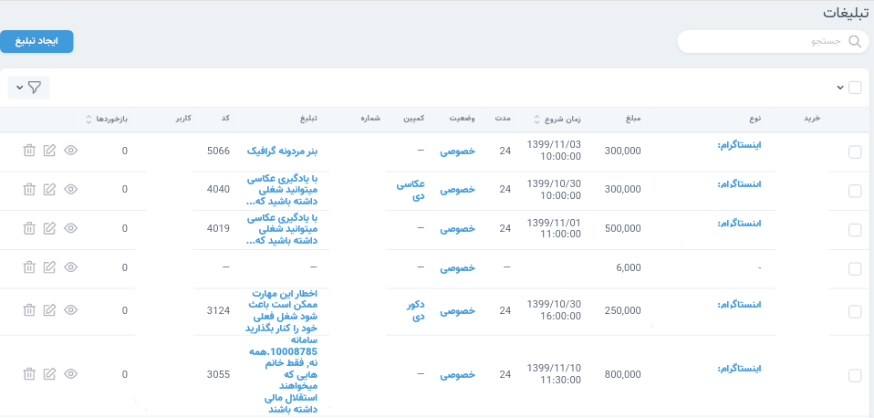
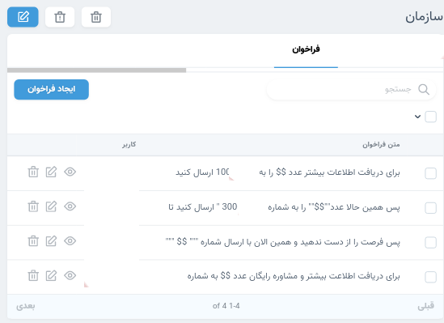

- [تبلیغات](#تبلیغات)
- [خرید ها](#خرید-ها)
- [محتوای تبلیغاتی](#محتوای-تبلیغاتی)
- [کمپین](#کمپین)
- [امضا الکترونیکی](#امضا-الکترونیکی)
- [شماره های دریافتی](#شماره-های-دریافتی)
- [تنخواه](#تنخواه)
- [سازمان](#سازمان)
- [منابع](#منابع)

---

#### تبلیغات

تبلیغات به صورت زیر مجموعه خریدها تعریف می شوند.
ایجاد تبلیغات حتما باید از قسمت خریدها شود.

در قسمت تبلیغات ، همه تبلیغات انجام شده را تنها می توانید مشاهده نمایید.

تبلیغات لیان بر اساس وضعیت سه نوع هستند:

انجام شده:

تبلیغاتی که پرداخت شده و منتشر شده اند.

رزرو شده:

درصورتی که هزینه یک تبلیغ پرداخت و تاریخ انتشار آن در آینده، مشخص باشد جز تبلیغات رزرو شده محسوب می شود.

در انتظار:

تبلیغاتی که زمان انتشارشان در آینده مشخص نباشد تبلیغات در انتظار محسوب می شوند.

##### خرید ها

تمامی پرداختهایی که جهت تبلیغات انجام می شوند در بخش خریدها باید ثبت گردند.

تبلیغات انجام شده از هر خرید (زیرخریدها) بعد از ثبت خرید در همین بخش باید ثبت گردند.

در ادامه ابتدا روش ثبت خریدها و سپس روش ثبت تبلیغ ها توضیح داده خواهد شد.

ایجاد خرید:

برای ثبت خریدها، لازم است مواردی که در تصویر مشاهده می کنید را تکمیل نمایید. همچنین امکان افزودن دو تصویر برای هر خرید وجود دارد و لازم است حداقل یک تصویر از تراکنش انجام شده را آپلود نمایید.

ایجاد تبلیغ:

تبلیغات زیرمجموعه خریدها محسوب می شوند. برای ثبت تبلیغات به خرید مربوطه بروید و گزینه ثبت تبلیغ را انتخاب نمایید.

فیلد خرید همان نام ادمین می باشد که هنگام ایجاد خرید ثبت نموده اید.

منبع تبلیغاتی خود را انتخاب و سپس صفحه یا کانالی که تبلیغ در آن انجام شده است را نیز انتخاب نمایید.

درنظر داشته باشید که این صفحه اجتماعی را باید از قبل در قسمت منابع تعریف کرده باشید.

##### محتوای تبلیغاتی

بخش محتوای تبلیغاتی یک آرشیو از متن ها و بنری های تبلیغاتی می باشد که در سامانه استفاده می شوند.

برای ثبت محتوای تبلیغاتی جدید

##### کمپین

تبلیغات سامانه لیان در قالب کمپین هایی که هر سازمان تعریف می کند انجام می شوند. از مزیت های تعریف کمپین ها می توان به بهینه سازی و دریافت بازخورد از تبلیغات انجام شده در هر سازمان اشاره نمود.

برای هر کمپین یک بازه زمانی،اعضای کمپین و تعداد شماره های هدف آن تعیین می شود.

همچنین برای هر کمپین امکان تهیه گزارش وجود دارد.

در بخش گزارشات امکان مشاهده بازخورد تبلیغات هر کمپین ها فراهم شده است.

---

#### تنخواه

###### دریافتی

تنخواه دریافت شده توسط کاربران سامانه لیان در قسمت دریافتی تنخواه باید ثبت گردند.

###### پرداختی

این قسمت مربوط به تمامی هزینه های انجام شده از تنخواه می باشد.

برای ثبت پرداخت جدید لازم است یک فرم مطابق تصویر تکمیل نمایید.

درنظر داشته باشید تمامی تبلیغات انجام شده از یک تنخواه به صورت اتوماتیک در بخش پرداختی های تنخواه گردان مربوطه ثبت خواهند شد.

---

#### امضا الکترونیکی

هر کاربر امکان آپلود امضا در پروفایل خود را دارد . امضای الکترونیکی برای پذیرش و رد گزارش تنخواه ها و همچنین برای امضاکردن تبلیغات استفاده می شوند.

امضای الکترونیکی تبلیغات:

با ایجاد امضای الکترونیکی تبلیغات ، یک گزارش از تبلیغات انجام شده ایجاد و امکان رد و یا تایید از سوی امضا کنندگان نیز فراهم می شود.

امضای الکترونیکی تنخواه:

در این قسمت امضاکنندگان هر سازمان امکان ایجاد امضای الکترونیکی تنخواه را دارند.

با انتخاب تنخواه گردان، می توانید گزارش دریافتی و پرداختی های کاربر موردنظر را در تاریخ مشخص شده مشاهده نمایید.
همچنین امکان دانلود گزارش به صورت فایل پی دی اف دارد.

#### شماره های دریافتی

پس از ثبت تبلیغ شماره مشتریانی که پیامک درخواست مشاوره ارسال می نمایند، در بخش شماره های دریافتی قابل شماهده می باشد.

دریافت شماره مشتریان از پنل های پیامکی این امکان را به وجود می آورد که بازخورد تبلیغات مختلف را استخراج و بررسی نمایید.

---

#### سازمان

###### اطلاعات سازمان

اطلاعات هر سازمان شامل نام سازمان،نام صاحب سازمان و تعداد کاربران آن سازمان می باشد.

###### کاربران

اعضای سازمان ها را می توانید در بخش کاربران آن سازمان مشاهده نمایید.

###### امضاکنندگان سازمان

برای تایید یا رد تبلیغات و همچنین تنخواه ها لازم است امضاکنندگان هر سازمان مشخص شوند.
امکان آپلود تصویر امضا در پرفایل هر کاربر وجود دارد.

###### تنخواه گردان ها

کاربرانی که در یک سازمان تخواه دریافت می کنند باید در بخش تنخواه گردان ها مشخص شده باشند.

###### مراکز هزینه تنخواه

در هنگام ثبت پرداختی ها لازم است مرکز هزینه تنخواه هم مشخص گردد. مراکز هزینه تنخواه باید از پیش در قسمت سازمان تعریف شده باشد.

###### دپارتمان

برای مدیریت بهتر بازاریابی و فروش کسب و کارها می توان برای هر بخش از یک سازمان تجاری دپارتمان متفاوتی در سامانه لیان تعریف نمود.
هر دپارتمان می تواند شامل دوره های متعددی باشد.

دوره:
دوره های آموزشی فروخته شده در سامانه را در بخش دوره ها تعریف نمایید. هنگام ثبت هر دوره علاوه بر نام دوره، نام دپارتمان مربوطه نیز باید انتخاب گردد.

###### شماره

شماره های پنل های پیامکی در این بخش تعریف و ثبت می شوند.

###### سبک طراحی

سبک طراحی بنر های تبلیغاتی در این بخش قابل تعریف می باشد. هنگام ایجاد محتوای تبلیغاتی سبک طراحی ثبت می شود.

###### فراخوان

فراخوان ها، متن های کوتاه پیش فرضی هستند که برای محتواهای تبلیغاتی استفاده می شوند. در متن فراخوان ها می توان کد پیامکی و شماره پنل پیامک را به صورت متغیر تعریف نمود.

متغیر کد پیامک با علامت ($) و شماره پنل پیامک با علامت (%) نمایش داده می شود.

در تصویر زیر نمونه ای از فراخوان های ثبت شده در لیان را می بینید.

###### مخاطبین

در این بخش، مخاطبین منابع تبلیغاتی سامانه تعریف می شوند. هنگام ثبت منابع، انتخاب نوع مخاطب از بین مخاطبین تعریف شده در بخش تعاریف انجام می شود.

###### موضوعات

در این بخش موضوع محتوا برای منابع تبلیغاتی تعریف می شود. هنگام ثبت منابع، موضوع منبع تبلیغاتی از بین موضوعات تعریف شده انتخاب می شود.

###### هشتگ

با تعریف هشتگ ها در بخش تعاریف هنگام ثبت محتوای تبلیغاتی می توانید هشتگ های موردنظر را انتخاب نمایید.

###### تنظیمات

یکی از مقادیر موجود در تنظیمات که برای هر سازمان قابل تغییر می باشد، entering.delay می باشد.

این تنظیمات مربوط به
تعداد ساعتهایی که پس از ثبت یک فیش یا تبلیغ قابل ثبت در سامانه می باشد.

---

#### منابع

رسانه های اجتماعی که منابع تبلیغاتی سامانه محسوب می شوند باید در سامانه ثبت شوند.

برای نمونه اینستاگرام، سروش،روبیکا و گپ از منابع تبلیغاتی هستند.

در تصویر زیر می توانید فرم ثبت صفحات اینستاگرام را ببنید.

